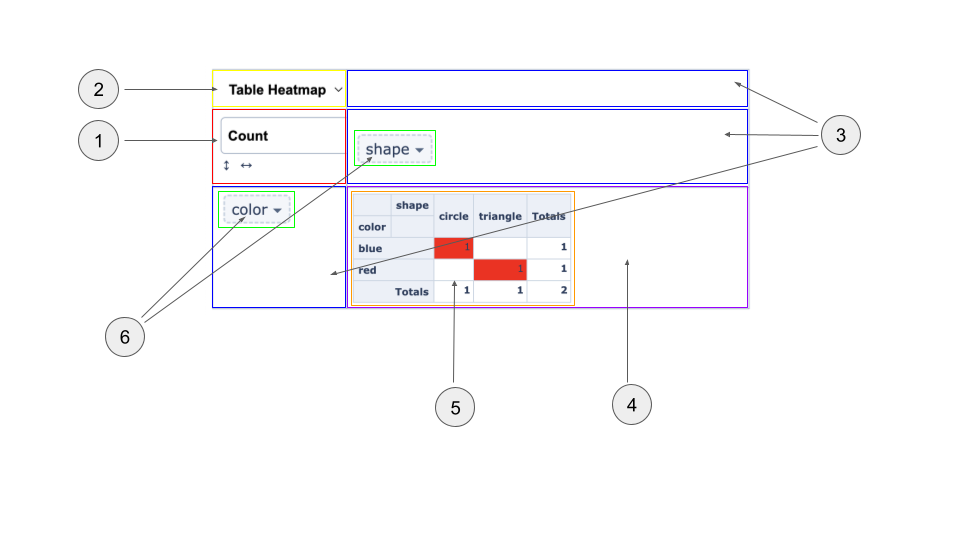
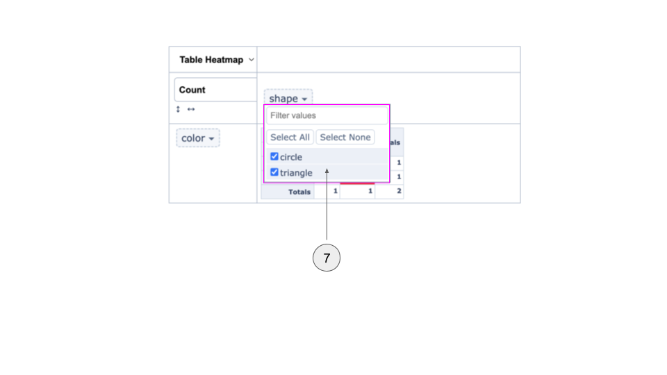

# 피벗테이블 개발 문서

> _작성중인 내용으로 정확하지 않을 수 있습니다_

- [Vue Pivottable 라이브러리 구조 분석](./vue-pivottable-as-is.md)
- [Vue3 Pivottable 컴포넌트 구조 및 마이그레이션 설계](./vue-pivottable-migration-design-spec.md)
- [데이터 흐름도 다이어그램](./data-flow.md)

## 컴포넌트 나누기

|No.|Name               |Description        |
|---|-------------------|-------------------|
|1  |VAggregatorCell    |집계함수와 그룹화할 속성을 선택하고 데이터를 정렬합니다.|
|2  |VRendererCell      |렌더러 타입을 선택하는 셀입니다.|
|3  |VDragnDropCell     |드래그 앤 드랍이 가능한 셀입니다.|
|4  |VPivottable        |선택한 렌더러 또는 제공받은 렌더러를 감싸는 영역입니다.|
|5  |TableRenderer      |내장된 테이블 렌더러 컴포넌트입니다.|
|6  |VDraggableAttribute|DnD셀 영역에 위치한 속성들입니다.|
|7  |VFilterBox         |선택한 속성의 데이터 값들을 필터링합니다.|
|-  |VPivottableUi      |전체를 포괄하는 피벗테이블 사용자 인터페이스 영역입니다.|
|-  |VDropdown          |(1)과 (2)에서 재사용하는 드랍다운 컴포넌트입니다.|
