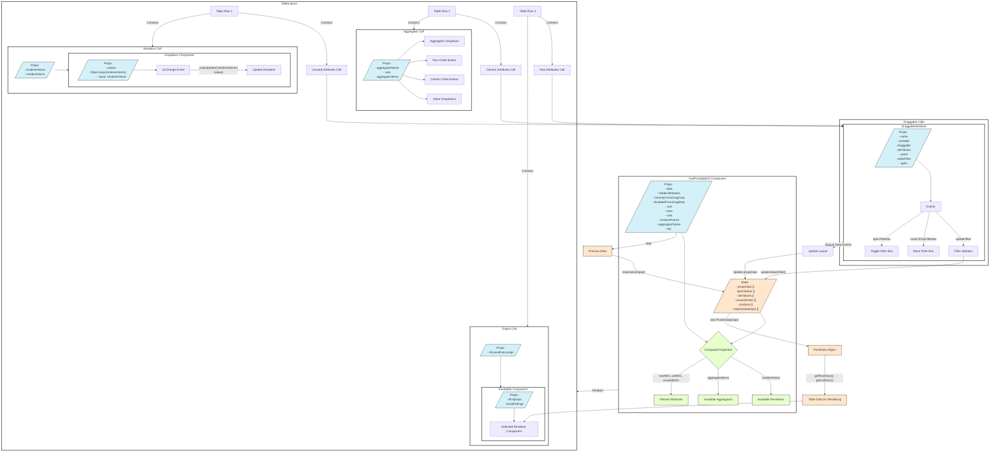

```mermaid

graph TD
    %% Main Component Flow
    subgraph VuePivottableUI[VuePivottableUI Component]
        UI_Props[/"Props:
        - data
        - hiddenAttributes
        - sortonlyFromDragDrop
        - disabledFromDragDrop
        - cols
        - rows
        - vals
        - rendererName
        - aggregatorName
        - etc."/]
        UI_Data[/"State:
        - propsData {}
        - openStatus {}
        - attrValues {}
        - unusedOrder []
        - zIndices {}
        - materializedInput []"/]
        
        UI_Props --> UI_Compute{Computed Properties}
        UI_Data --> UI_Compute
        
        UI_Compute -->|"rendererItems"| Renderers[Available Renderers]
        UI_Compute -->|"aggregatorItems"| Aggregators[Available Aggregators]
        UI_Compute -->|"rowAttrs, colAttrs, unusedAttrs"| Attributes[Filtered Attributes]
    end


    %% Propagation to child components
    VuePivottableUI -->|"Renders"| TableLayout["Table Layout"]
    
    subgraph TableLayout
        %% First row
        TR1[Table Row 1] -->|"Contains"| RendererCell
        TR1 -->|"Contains"| UnusedAttrsCell
        
        %% Second row
        TR2[Table Row 2] -->|"Contains"| AggregatorCell
        TR2 -->|"Contains"| ColAttrsCell
        
        %% Third row
        TR3[Table Row 3] -->|"Contains"| RowAttrsCell
        TR3 -->|"Contains"| OutputCell
    end


    %% Renderer Cell Flow
    subgraph RendererCell[Renderer Cell]
        RC_Props[/"Props:
        - rendererName
        - rendererItems"/]
        
        RC_Props --> Dropdown
    end
    
    %% Dropdown Component
    subgraph Dropdown[Dropdown Component]
        DD_Props[/"Props:
        - values: Object.keys(rendererItems)
        - value: rendererName"/]
        
        DD_Props --> DD_Change[onChange Event]
        DD_Change -->|"propUpdater('rendererName')(value)"| Update_Renderer[Update Renderer]
    end
    
    %% Aggregator Cell Flow
    subgraph AggregatorCell[Aggregator Cell]
        AC_Props[/"Props:
        - aggregatorName
        - vals
        - aggregatorItems"/]
        
        AC_Props --> AggDropdown[Aggregator Dropdown]
        AC_Props --> RowOrderBtn[Row Order Button]
        AC_Props --> ColOrderBtn[Column Order Button]
        AC_Props --> ValDropdowns[Value Dropdowns]
    end
    
    %% DraggableAttribute Components
    subgraph DnDCells[Draggable Cells]
        ColAttrsCell[Column Attributes Cell]
        RowAttrsCell[Row Attributes Cell]
        UnusedAttrsCell[Unused Attributes Cell]
        
        subgraph DraggableAttribute[DraggableAttribute]
            DA_Props[/"Props:
            - name
            - sortable
            - draggable
            - attrValues
            - sorter
            - valueFilter
            - open"/]
            
            DA_Props --> DA_Events[Events]
            DA_Events -->|"update:filter"| Filter_Update[Filter Updates]
            DA_Events -->|"moveToTop:filterbox"| Move_Filter[Move Filter Box]
            DA_Events -->|"open:filterbox"| Toggle_Filter[Toggle Filter Box]
        end
        
        ColAttrsCell --> DraggableAttribute
        RowAttrsCell --> DraggableAttribute
        UnusedAttrsCell --> DraggableAttribute
    end
    
    %% Output Cell Flow
    subgraph OutputCell[Output Cell]
        OC_Props[/"Props: 
        - All pivotData props"/]
        
        OC_Props --> PivotTable[Pivottable Component]
    end
    
    %% Pivottable Component
    subgraph PivotTable[Pivottable Component]
        PT_Props[/"Props:
        - All $props
        - localeStrings"/]
        
        PT_Props --> PT_Renderer[Selected Renderer Component]
    end
    
    %% Data Processing Flow
    UI_Props -->|"data"| ProcessData[Process Data]
    ProcessData -->|"materializeInput()"| UI_Data
    UI_Data -->|"new PivotData(props)"| PivotDataObj[PivotData Object]
    PivotDataObj -->|"getRowKeys(), getColKeys()"| TableData[Table Data for Rendering]
    TableData --> PT_Renderer
    
    %% Event Flow
    DraggableAttribute -->|"Drag & Drop Events"| Update_Layout[Update Layout]
    Update_Layout -->|"Update propsData"| UI_Data
    Filter_Update -->|"updateValueFilter()"| UI_Data
    
    %% Style with different colors for props vs state
    classDef props fill:#d4f1f9,stroke:#000,stroke-width:1px
    classDef state fill:#ffe6cc,stroke:#000,stroke-width:1px
    classDef computed fill:#e6ffcc,stroke:#000,stroke-width:1px
    classDef component fill:#fff,stroke:#000,stroke-width:2px
    
    class UI_Props,RC_Props,DD_Props,AC_Props,DA_Props,OC_Props,PT_Props props
    class UI_Data,ProcessData,PivotDataObj,TableData state
    class UI_Compute,Renderers,Aggregators,Attributes computed
    class VuePivottableUI,TableLayout,RendererCell,Dropdown,AggregatorCell,DnDCells,OutputCell,PivotTable,DraggableAttribute component

```
