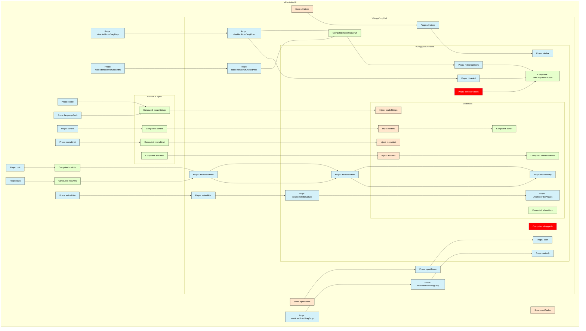

# VDraggableAttribute

## Diagram

```mermaid

graph TD
  %% 색상 정의
  classDef props fill:#d4f1f9,stroke:#000,stroke-width:1px,color:#000
  classDef state fill:#ffe6cc,stroke:#000,stroke-width:1px,color:#000
  classDef computed fill:#e6ffcc,stroke:#000,stroke-width:1px,color:#000
  classDef event fill:#ffe6e6,stroke:#000,stroke-width:1px,color:#000
  classDef component fill:#fff,stroke:#000,stroke-width:2px,color:#000
  classDef warnning fill:red,color:#fff

  subgraph A[VPivottableUI]

    subgraph AA[Provide & Inject]
      AA-C1[Computed: localeStrings]:::computed
      AA-C2[Computed: sorters]:::computed
      AA-C3[Computed: menuLimit]:::computed
      AA-C4[Computed: allFilters]:::computed
    end
    
    A-P1[Props: locale]:::props
    A-P2[Props: languagePack]:::props
    A-P3[Props: cols]:::props
    A-P4[Props: rows]:::props
    A-P5[Props: valueFilter]:::props
    A-P6[Props: sorters]:::props
    A-P7[Props: restrictedFromDragDrop]:::props
    A-P8[Props: disabledFromDragDrop]:::props
    A-P9[Props: hideFilterBoxOfUnusedAttrs]:::props
    A-P10[Props: menuLimit]:::props
    A-C1[Computed: colAttrs]:::computed
    A-C2[Computed: rowAttrs]:::computed
    A-S1[State: zIndices]:::state
    A-S2[State: maxZIndex]:::state
    A-S3[State: openStatus]:::state
    

    subgraph B[VDragnDropCell]
      B-P1[Props: attributeNames]:::props
      B-P2[Props: valueFilter]:::props
      B-P3[Props: restrictedFromDragDrop]:::props
      B-P4[Props: disabledFromDragDrop]:::props
      B-P5[Props: hideFilterBoxOfUnusedAttrs]:::props
      B-P6[Props: zIndices]:::props
      B-P7[Props: openStatus]:::props
      B-C1[Computed: hideDropDown]:::computed

      subgraph C[VDraggableAttribute]
        C-P1[Props: attributeName]:::props
        C-P2[Props: unselecteFilterValues]:::props
        C-P3[Props: hideDropDown]:::props
        C-P4[Props: disabled]:::props
        C-P5[Props: zIndex]:::props
        C-P6[Props: open]:::props
        C-P7[Props: attributeValues]:::warnning
        C-P8[Props: sortonly]:::props
        C-C1[Computed: draggable]:::warnning
        C-C2[Computed: hideDropDownButton]:::computed

        subgraph D[VFilterBox]
          D-I1[Inject: localeStrings]:::state
          D-I2[Inject: sorters]:::state
          D-I3[Inject: menuLimit]:::state
          D-I4[Inject: allFilters]:::state

          D-P1[Props: filterBoxKey]:::props
          D-P2[Props: unselecteFilterValues]:::props
          D-C1[Computed: filterBoxValues]:::computed
          D-C2[Computed: sorter]:::computed
          D-C3[Computed: showMenu]:::computed

        end
      end
    end

    %% Provide & Inject Data Flow
    A-P1 ---> AA-C1
    A-P2 ---> AA-C1
    AA-C1 ----> D-I1
    A-P6 ---> AA-C2 ----> D-I2 ----> D-C2
    A-P10 ---> AA-C3 ----> D-I3
    AA-C4 -------> D-I4 -----> D-C1

    %% Props Data Flow
    A-S1 ----> B-P6 ----> C-P5
    A-S3 ----> B-P7 ----> C-P6
    A-P3 ----> A-C1 ----> B-P1 -----> C-P1 ------> D-P1
    A-P4 ----> A-C2 ----> B-P1 -----> C-P1 ------> D-P1
    A-P5 ----> B-P2 ----> C-P2 -------> D-P2
    A-P7 ----> B-P3 ----> C-P8
    A-P8 ----> B-P4 ----> B-C1
    B-P4 ----> C-P4
    A-P9 ----> B-P5 ----> B-C1
    B-C1 ----> C-P3
    C-P3 ---> C-C2
    C-P7 ---> C-C2
    C-P4 ---> C-C2

  end
```

## Description
