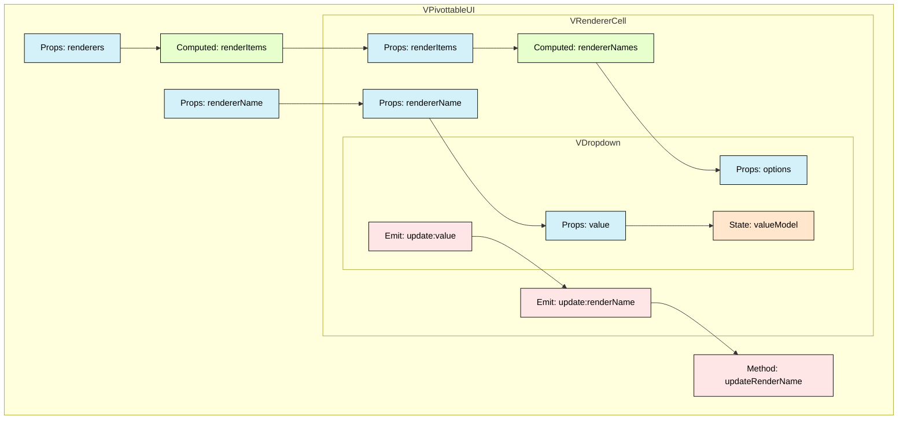

# VRendererCell

## Diagram

## Description

| 컴포넌트 | 유형 | 이름 | 설명 |
|---------|------|------|------|
| VPivottableUI | Props | renderers | 개발자가 커스텀으로 제공하는 렌더러 목록 객체 배열 |
| | Props | rendererName | 설정된 렌더러타입의 이름 |
| | Computed | renderItems | renderers props 또는 기본 테이블 렌더러 목록 객체 배열 |
| | Method | updateRenderName | 렌더러타입의 이름을 업데이트 하는 메소드 |
| VRendererCell | Props | renderItems | VPivottableUI로부터 전달받은 렌더러 아이템 목록 |
| | Props | rendererName | 현재 선택된 렌더러 이름 |
| | Computed | rendererNames | renderItems를 기반으로 드롭다운에 표시할 렌더러 이름 목록 |
| | Emit | update:renderName | 렌더러 이름이 변경될 때 상위 컴포넌트로 이벤트 전달 |
| VDropdown | Props | options | 드롭다운에 표시될 옵션 목록 |
| | Props | value | 현재 선택된 값 |
| | State | valueModel | value props를 기반으로 내부 상태 관리 |
| | Emit | update:value | 값이 변경될 때 상위 컴포넌트로 이벤트 전달 |
