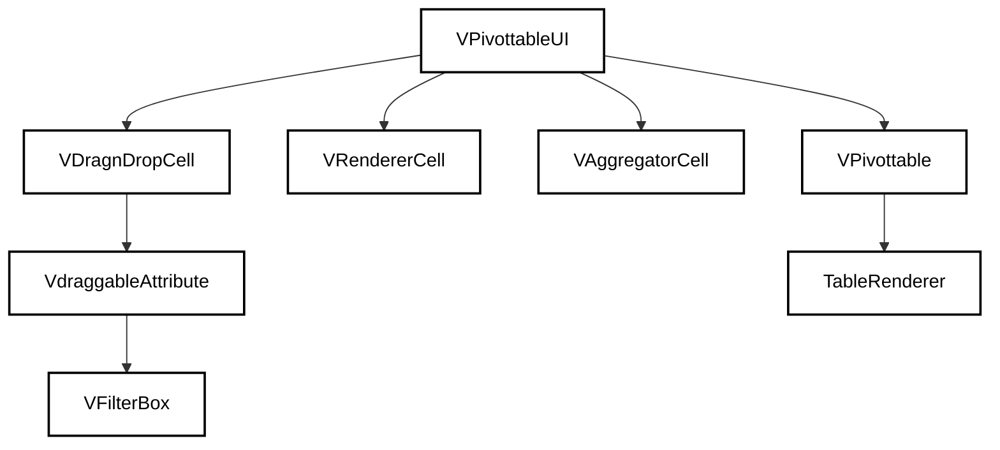
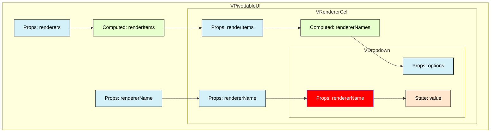
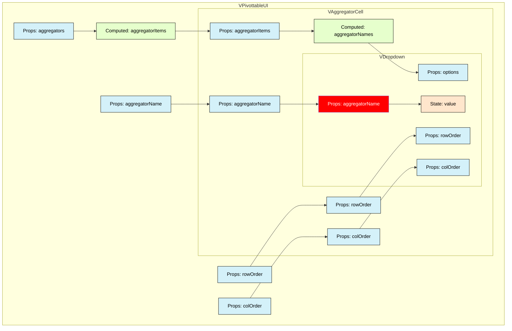
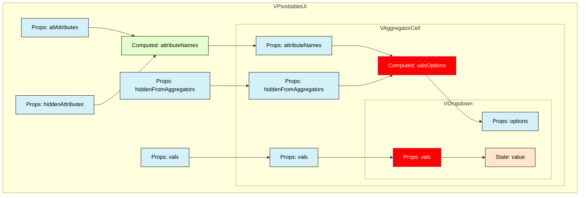
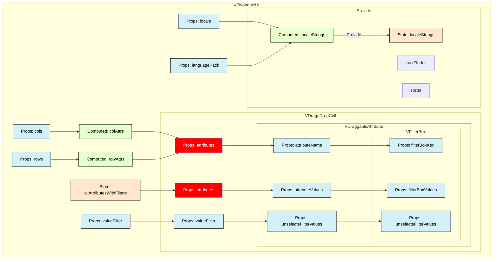

# Vue Pivottable 다이어그램

## 컴포넌트 트리구조

## VPivottableUI 컴포넌트 데이터 흐름도

### VRendererCell

### VAggregatorCell > VDropdown(Aggregator)

### VAggregatorCell > VDropdown(Vals)

### VDragnDropCell > VDraggableAttrubute > VFilterBox

