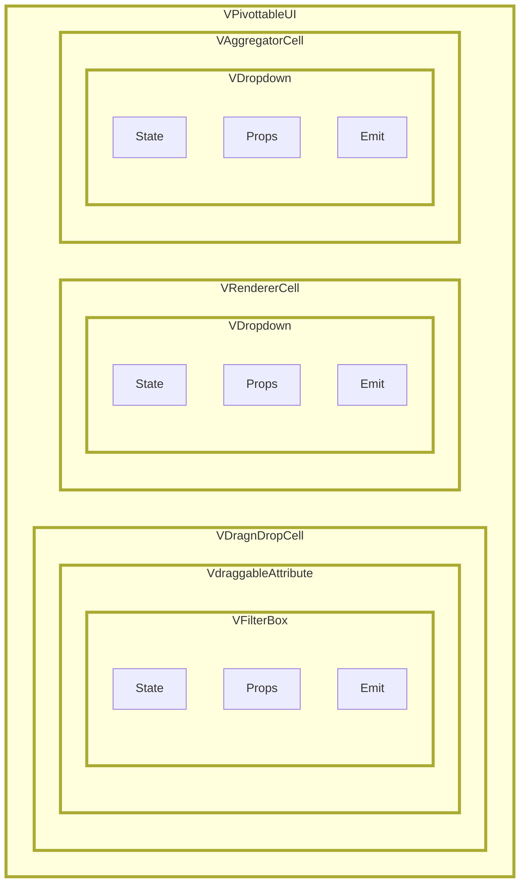
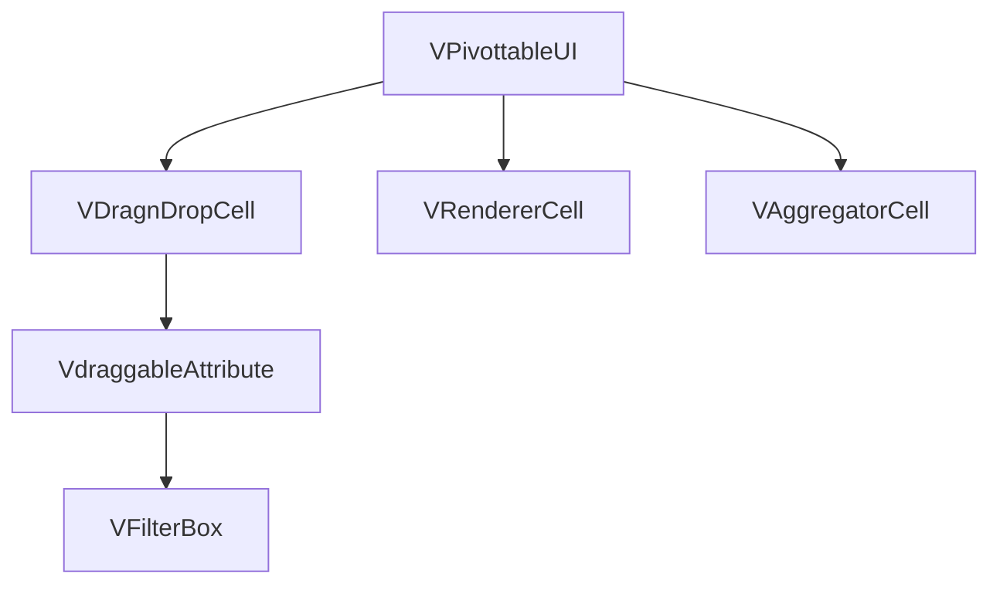

# Vue Pivottable 컴포넌트 구조

## 계층형

```mermaid
graph TD

  subgraph A[VPivottableUI]
    style A stroke-width:4px;

    subgraph B[VDragnDropCell]
      style B stroke-width:4px;

      subgraph C[VdraggableAttribute]
        style C stroke-width:4px;

        subgraph D[VFilterBox]
          style D stroke-width:4px;
          D1[State]
          D2[Props]
          D3[Emit]
        end
      end
    end

    subgraph E[VRendererCell]
      style E stroke-width:4px;
      subgraph F[VDropdown]
        style F stroke-width:4px;
        F1[State]
        F2[Props]
        F3[Emit]
      end
    end

    subgraph G[VAggregatorCell]
      style G stroke-width:4px;
      subgraph H[VDropdown]
        style H stroke-width:4px;
        H1[State]
        H2[Props]
        H3[Emit]
      end
    end
  end


```

## 트리

```mermaid
graph TD
  A[VPivottableUI] --> B[VDragnDropCell] --> C[VdraggableAttribute] --> D[VFilterBox]
  A --> E[VRendererCell]
  A --> G[VAggregatorCell]

```
