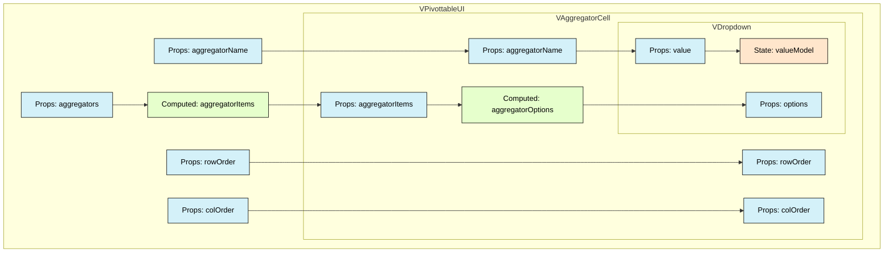
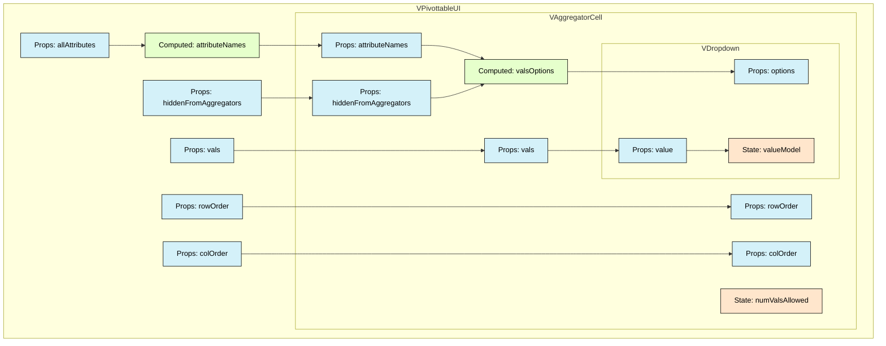

# VAggregatorCell

## Diagram

### VAggregatorCell > VDropdown(Aggregator)

```mermaid
graph TD
  %% 색상 정의
  classDef props fill:#d4f1f9,stroke:#000,stroke-width:1px,color:#000
  classDef state fill:#ffe6cc,stroke:#000,stroke-width:1px,color:#000
  classDef computed fill:#e6ffcc,stroke:#000,stroke-width:1px,color:#000
  classDef event fill:#ffe6e6,stroke:#000,stroke-width:1px,color:#000
  classDef component fill:#fff,stroke:#000,stroke-width:2px,color:#000
  classDef warnning fill:red,color:#fff

  subgraph A[VPivottableUI]
    AP-1[Props: aggregators]:::props
    AC-1[Computed: aggregatorItems]:::computed
    AP-2[Props: aggregatorName]:::props
    AP-3[Props: rowOrder]:::props
    AP-4[Props: colOrder]:::props

    subgraph B[VAggregatorCell]
      BP-1[Props: aggregatorItems]:::props
      BC-1[Computed: aggregatorOptions]:::computed
      BP-2[Props: aggregatorName]:::props
      BP-3[Props: rowOrder]:::props
      BP-4[Props: colOrder]:::props 

      subgraph C[VDropdown]
        CS-1[State: valueModel]:::state
        CP-1[Props: options]:::props
        CP-2[Props: value]:::props
      end
    end

    AP-1 --> AC-1 --> BP-1 --> BC-1 ---> CP-1
    AP-2 ---> BP-2 --> CP-2
    AP-3 -----> BP-3
    AP-4 -----> BP-4
    CP-2 --> CS-1

  end
```

### VAggregatorCell > VDropdown(Vals)

```mermaid
graph TD
  %% 색상 정의
  classDef props fill:#d4f1f9,stroke:#000,stroke-width:1px,color:#000
  classDef state fill:#ffe6cc,stroke:#000,stroke-width:1px,color:#000
  classDef computed fill:#e6ffcc,stroke:#000,stroke-width:1px,color:#000
  classDef event fill:#ffe6e6,stroke:#000,stroke-width:1px,color:#000
  classDef component fill:#fff,stroke:#000,stroke-width:2px,color:#000
  classDef warnning fill:red,color:#fff

  subgraph A[VPivottableUI]
    AP-1[Props: allAttributes]:::props 
    AC-1[Computed: attributeNames]:::computed 
    AP-2[Props: hiddenFromAggregators]:::props 
    AP-3[Props: vals]:::props 
    AP-4[Props: rowOrder]:::props
    AP-5[Props: colOrder]:::props

    subgraph B[VAggregatorCell]
      BP-1[Props: attributeNames]:::props 
      BP-2[Props: hiddenFromAggregators]:::props 
      BP-3[Props: vals]:::props 
      BP-4[Props: rowOrder]:::props
      BP-5[Props: colOrder]:::props 
      BS-1[State: numValsAllowed]:::state
      BC-1[Computed: valsOptions]:::computed

      subgraph C[VDropdown]
        CP-1[Props: options]:::props
        CP-2[Props: value]:::props 
        CS-1[State: valueModel]:::state

      end
    end

    AP-1 --> AC-1 --> BP-1 --> BC-1 ---> CP-1
    AP-2 --> BP-2 --> BC-1
    AP-3 ---> BP-3 --> CP-2 --> CS-1
    AP-4 -----> BP-4
    AP-5 -----> BP-5
    
  end

```

## Description

TBD
