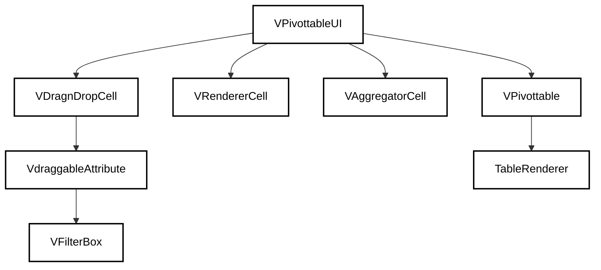

# Vue Pivottable 다이어그램

## 컴포넌트 트리구조

```mermaid
graph TD
  %% 색상 정의
  classDef props fill:#d4f1f9,stroke:#000,stroke-width:1px,color:#000
  classDef state fill:#ffe6cc,stroke:#000,stroke-width:1px,color:#000
  classDef computed fill:#e6ffcc,stroke:#000,stroke-width:1px,color:#000
  classDef event fill:#ffe6e6,stroke:#000,stroke-width:1px,color:#000
  classDef component fill:#fff,stroke:#000,stroke-width:2px,color:#000
  classDef warnning fill:red,color:#fff

  A[VPivottableUI]:::component --> B[VDragnDropCell]:::component --> C[VdraggableAttribute]:::component --> D[VFilterBox]:::component
  A --> E[VRendererCell]:::component
  A --> G[VAggregatorCell]:::component
  A --> H[VPivottable]:::component --> I[TableRenderer]:::component

```
